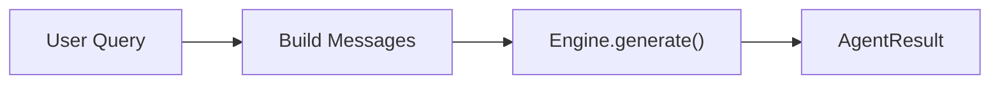
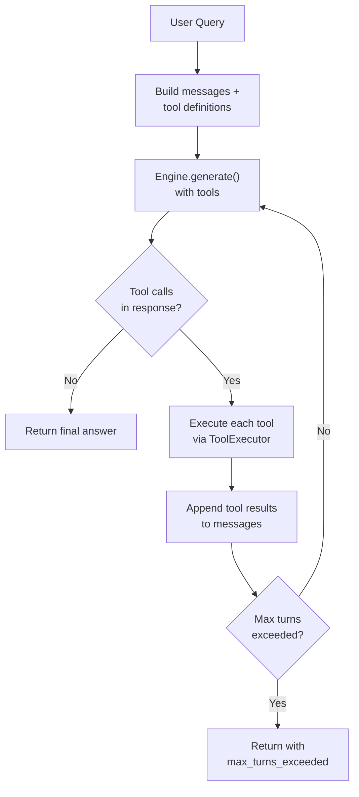
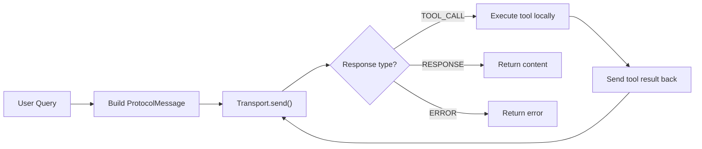

# Agentic Logic Pillar

The Agentic Logic pillar provides **pluggable agents** that handle queries with varying levels of sophistication -- from simple single-turn responses to multi-turn tool-calling loops and external agent communication.

---

## BaseAgent ABC

All agents implement the `BaseAgent` abstract base class:

```python
class BaseAgent(ABC):
    agent_id: str

    @abstractmethod
    def run(
        self,
        input: str,
        context: Optional[AgentContext] = None,
        **kwargs: Any,
    ) -> AgentResult:
        """Execute the agent on *input* and return an AgentResult."""
```

### The `run()` Contract

The `run()` method is the single entry point for all agent implementations. It receives:

- **`input`** -- The user's query text
- **`context`** -- An optional `AgentContext` with conversation history, tool names, and memory results
- **`**kwargs`** -- Additional implementation-specific parameters

It returns an `AgentResult` containing the response content, any tool results, the number of turns taken, and metadata.

### Supporting Dataclasses

```python
@dataclass(slots=True)
class AgentContext:
    conversation: Conversation    # Prior messages for multi-turn context
    tools: List[str]              # Available tool names
    memory_results: List[Any]     # Pre-fetched memory search results
    metadata: Dict[str, Any]      # Arbitrary key-value pairs

@dataclass(slots=True)
class AgentResult:
    content: str                  # The agent's response text
    tool_results: List[ToolResult]  # Results from tool invocations
    turns: int                    # Number of inference turns taken
    metadata: Dict[str, Any]      # Arbitrary metadata
```

---

## Agent Implementations

### SimpleAgent

**Registry key:** `simple`

The simplest agent implementation -- a single-turn, no-tool query-to-response pipeline.



How it works:

1. Publishes `AGENT_TURN_START` on the event bus
2. Builds a message list from any existing conversation context plus the user's input
3. Calls `instrumented_generate()` (if bus is available) or `engine.generate()` directly
4. Publishes `AGENT_TURN_END` and returns an `AgentResult` with `turns=1`

```python
from openjarvis.agents.simple import SimpleAgent

agent = SimpleAgent(engine, model="qwen3:8b", bus=bus)
result = agent.run("What is the capital of France?")
print(result.content)  # "The capital of France is Paris."
```

### OrchestratorAgent

**Registry key:** `orchestrator`

A multi-turn agent that implements a **tool-calling loop**. The LLM can request tool invocations, and the results are fed back for further processing until the model produces a final text response.



How it works:

1. Builds initial messages from context and user input
2. Converts available tools to OpenAI function-calling format via `ToolExecutor.get_openai_tools()`
3. Enters a loop (up to `max_turns` iterations):
    - Calls `engine.generate()` with messages and tool definitions
    - If the response contains `tool_calls`, executes each tool and appends the results as `TOOL` messages
    - If no `tool_calls` are present, returns the content as the final answer
4. If `max_turns` is exceeded, returns the last content or a warning message

```python
from openjarvis.agents.orchestrator import OrchestratorAgent
from openjarvis.tools.calculator import CalculatorTool
from openjarvis.tools.think import ThinkTool

agent = OrchestratorAgent(
    engine,
    model="qwen3:8b",
    tools=[CalculatorTool(), ThinkTool()],
    bus=bus,
    max_turns=10,
)
result = agent.run("What is 2^10 + 3^5?")
# The agent may call the calculator tool, get "1267", then respond
```

### OpenClawAgent

**Registry key:** `openclaw`

Communicates with an external OpenClaw Pi agent server via HTTP or subprocess transport. This agent delegates query handling to a separate process or service.



How it works:

1. Checks transport health
2. Sends a `QUERY` message through the transport
3. If the response is a `TOOL_CALL`, executes the tool locally via `ToolRegistry` and sends the result back
4. Continues the tool-call loop until a `RESPONSE` or `ERROR` is received

```python
from openjarvis.agents.openclaw import OpenClawAgent

# HTTP mode (connects to OpenClaw server)
agent = OpenClawAgent(engine, model="qwen3:8b", mode="http")

# Subprocess mode (launches Node.js process)
agent = OpenClawAgent(engine, model="qwen3:8b", mode="subprocess")
```

### CustomAgent

**Registry key:** `custom`

A template for user-defined agents. Its `run()` method raises `NotImplementedError` -- users must subclass it and override `run()`:

```python
from openjarvis.agents.custom import CustomAgent
from openjarvis.core.registry import AgentRegistry

@AgentRegistry.register("my-agent")
class MyAgent(CustomAgent):
    agent_id = "my-agent"

    def run(self, input, context=None, **kwargs):
        # Custom logic here
        return AgentResult(content="Custom response")
```

---

## Tool System Integration

The `OrchestratorAgent` uses the `ToolExecutor` to dispatch tool calls. The tool system is built on the `BaseTool` ABC:

```python
class BaseTool(ABC):
    tool_id: str

    @property
    @abstractmethod
    def spec(self) -> ToolSpec:
        """Return the tool specification."""

    @abstractmethod
    def execute(self, **params: Any) -> ToolResult:
        """Execute the tool with the given parameters."""

    def to_openai_function(self) -> Dict[str, Any]:
        """Convert to OpenAI function-calling format."""
```

### Built-in Tools

| Tool | Registry Key | Description |
|------|-------------|-------------|
| `CalculatorTool` | `calculator` | AST-based safe expression evaluator |
| `ThinkTool` | `think` | Reasoning scratchpad (returns input as-is) |
| `RetrievalTool` | `retrieval` | Memory search via a memory backend |
| `LLMTool` | `llm` | Sub-model calls (query a different model) |
| `FileReadTool` | `file_read` | Safe file reading with path validation |

### ToolExecutor

The `ToolExecutor` handles tool dispatch with JSON argument parsing, latency tracking, and event bus integration:

```python
class ToolExecutor:
    def __init__(self, tools: List[BaseTool], bus: Optional[EventBus] = None):
        self._tools = {t.spec.name: t for t in tools}
        self._bus = bus

    def execute(self, tool_call: ToolCall) -> ToolResult:
        """Parse arguments, dispatch to tool, measure latency, emit events."""

    def get_openai_tools(self) -> List[Dict[str, Any]]:
        """Return tools in OpenAI function-calling format."""
```

For each tool call:

1. Looks up the tool by name
2. Parses the JSON arguments string
3. Publishes `TOOL_CALL_START` on the event bus
4. Executes the tool with timing
5. Publishes `TOOL_CALL_END` with success status and latency
6. Returns the `ToolResult`

---

## OpenClaw Infrastructure

The OpenClaw infrastructure enables OpenJarvis agents to communicate with external OpenClaw servers through a structured protocol.

### Protocol

The `openclaw_protocol.py` module defines the wire protocol:

**Message Types:**

| Type | Direction | Purpose |
|------|-----------|---------|
| `QUERY` | Client -> Server | Send a user query |
| `RESPONSE` | Server -> Client | Return a response |
| `TOOL_CALL` | Server -> Client | Request tool execution |
| `TOOL_RESULT` | Client -> Server | Return tool execution result |
| `ERROR` | Server -> Client | Report an error |
| `HEALTH` | Client -> Server | Health check request |
| `HEALTH_OK` | Server -> Client | Health check response |

**ProtocolMessage dataclass:**

```python
@dataclass(slots=True)
class ProtocolMessage:
    type: MessageType
    id: str                            # UUID, auto-generated
    content: str = ""
    tool_name: Optional[str] = None
    tool_args: Optional[Dict] = None
    tool_result: Optional[str] = None
    error: Optional[str] = None
    metadata: Dict[str, Any] = field(default_factory=dict)
```

Messages are serialized to JSON lines via `serialize()` and deserialized via `deserialize()`.

### Transport

The `openclaw_transport.py` module provides two transport implementations:

**`HttpTransport`** -- Communicates via HTTP POST to an OpenClaw server:

- Default endpoint: `http://localhost:18789`
- Sends messages to `/api/query`
- Health check via `GET /health`

**`SubprocessTransport`** -- Launches a Node.js process and communicates via stdin/stdout:

- Sends JSON lines to the process's stdin
- Reads JSON line responses from stdout
- Auto-starts the process if it is not running
- Terminates the process on `close()`

### Plugin System

The `openclaw_plugin.py` module wraps OpenJarvis as an OpenClaw provider:

- **`ProviderPlugin`** -- Wraps an OpenJarvis engine for OpenClaw's `generate()` and `list_models()` interface
- **`MemorySearchManager`** -- Wraps a memory backend for OpenClaw's `search()`, `sync()`, and `status()` interface
- **`register()`** -- Entry point that returns plugin capabilities for OpenClaw discovery

---

## Event Bus Integration

All agents integrate with the `EventBus` for telemetry and trace collection:

| Event | Published By | When |
|-------|-------------|------|
| `AGENT_TURN_START` | All agents | Before starting query processing |
| `AGENT_TURN_END` | All agents | After producing a response |
| `INFERENCE_START` | OrchestratorAgent | Before each `engine.generate()` call |
| `INFERENCE_END` | OrchestratorAgent | After each `engine.generate()` call |
| `TOOL_CALL_START` | ToolExecutor / OpenClawAgent | Before executing a tool |
| `TOOL_CALL_END` | ToolExecutor / OpenClawAgent | After executing a tool |

These events are consumed by the `TelemetryStore` (for metrics) and `TraceCollector` (for interaction traces).

---

## Agent Registration

Agents are registered via the `@AgentRegistry.register("name")` decorator:

```python
from openjarvis.core.registry import AgentRegistry
from openjarvis.agents._stubs import BaseAgent

@AgentRegistry.register("my-agent")
class MyAgent(BaseAgent):
    agent_id = "my-agent"

    def run(self, input, context=None, **kwargs):
        ...
```

To list all registered agents:

```python
from openjarvis.core.registry import AgentRegistry

print(AgentRegistry.keys())
# ("simple", "orchestrator", "openclaw", "custom")
```

To instantiate an agent by key:

```python
agent = AgentRegistry.create("orchestrator", engine, model, tools=tools, bus=bus)
```
