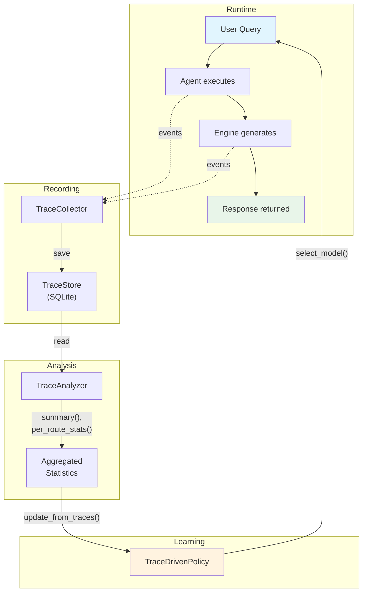

# Learning & Traces

The Learning system is a **cross-cutting concern** that connects all four pillars through trace-driven feedback. It determines which model handles each query (router policies), records the full interaction as a trace, analyzes outcomes, and updates policies based on what worked.

---

## RouterPolicy ABC

All routing policies implement the `RouterPolicy` abstract base class:

```python
class RouterPolicy(ABC):
    @abstractmethod
    def select_model(self, context: RoutingContext) -> str:
        """Return the model registry key best suited for *context*."""
```

### RoutingContext

The `RoutingContext` dataclass captures the characteristics of an incoming query:

```python
@dataclass(slots=True)
class RoutingContext:
    query: str = ""            # The raw query text
    query_length: int = 0      # Character count
    has_code: bool = False     # Whether code patterns were detected
    has_math: bool = False     # Whether math keywords were detected
    language: str = "en"       # Detected language
    urgency: float = 0.5      # 0 = low priority, 1 = real-time
    metadata: Dict[str, Any] = field(default_factory=dict)
```

---

## RouterPolicyRegistry

Router policies are registered in the `RouterPolicyRegistry` and selected at runtime. The system ships with three policies:

| Registry Key | Policy Class | Status | Description |
|-------------|-------------|--------|-------------|
| `heuristic` | `HeuristicRouter` | Active | Rule-based routing with 6 priority rules |
| `learned` | `TraceDrivenPolicy` | Active | Learns from trace outcomes |
| `grpo` | `GRPORouterPolicy` | Stub | Placeholder for future RL training |

Users select a policy via `config.toml` or the `--router` CLI flag:

```toml
[learning]
default_policy = "heuristic"
```

```bash
jarvis ask --router learned "What is the capital of France?"
```

### The `ensure_registered()` Pattern

Learning modules use a lazy registration pattern to survive registry clearing in tests:

```python
def ensure_registered() -> None:
    """Register TraceDrivenPolicy if not already present."""
    if not RouterPolicyRegistry.contains("learned"):
        RouterPolicyRegistry.register_value("learned", TraceDrivenPolicy)

ensure_registered()  # Called at module import time
```

This ensures that policies are available even after `RouterPolicyRegistry.clear()` is called in test teardown, because re-importing the module re-registers them.

---

## HeuristicRouter (Heuristic Policy)

The `HeuristicRouter` is the default routing policy. It uses static rules to select models based on query characteristics. See the [Intelligence Pillar](intelligence.md) documentation for full details on its six priority rules.

The `heuristic_policy.py` module wires the existing `HeuristicRouter` (from the Intelligence pillar) into the `RouterPolicyRegistry`:

```python
# learning/heuristic_policy.py
def ensure_registered() -> None:
    if not RouterPolicyRegistry.contains("heuristic"):
        RouterPolicyRegistry.register_value("heuristic", HeuristicRouter)

ensure_registered()
```

---

## TraceDrivenPolicy (Learned Policy)

The `TraceDrivenPolicy` learns from historical traces to determine which model performs best for different types of queries. Unlike the heuristic router's static rules, this policy adapts based on actual outcomes.

### Query Classification

Queries are classified into broad categories for grouping:

| Category | Condition |
|----------|-----------|
| `code` | Contains code patterns (backticks, `def`, `class`, `import`, `function`) |
| `math` | Contains math keywords (`solve`, `integral`, `equation`, `calculate`, `compute`) |
| `short` | Query length < 50 characters |
| `long` | Query length > 500 characters |
| `general` | None of the above |

### Model Selection

When `select_model()` is called:

1. Classify the query into a category
2. If the policy map has an entry for this category **and** the confidence (sample count) exceeds `min_samples` (default: 5), use the learned model
3. Otherwise, fall back to: `default_model` -> `fallback_model` -> first available model

### Batch Updates via `update_from_traces()`

The primary update mechanism reads all traces from a `TraceAnalyzer` and recomputes the policy map:

```python
from openjarvis.learning.trace_policy import TraceDrivenPolicy
from openjarvis.traces.analyzer import TraceAnalyzer
from openjarvis.traces.store import TraceStore

store = TraceStore("traces.db")
analyzer = TraceAnalyzer(store)
policy = TraceDrivenPolicy(
    analyzer=analyzer,
    available_models=["qwen3:8b", "llama3.2:3b", "deepseek-coder-v2:16b"],
    default_model="qwen3:8b",
)

# Recompute routing decisions from trace history
result = policy.update_from_traces()
# {"updated": True, "query_classes": 3, "total_traces": 150, "changes": {...}}
```

The update algorithm:

1. Fetches all traces (optionally filtered by time range)
2. Groups traces by query classification
3. For each query class, scores each model using a **composite score**:
    - 60% success rate (fraction of traces with `outcome="success"`)
    - 40% average feedback score (user quality ratings)
4. Selects the model with the highest composite score for each query class
5. Returns a summary of changes

### Online Updates via `observe()`

For real-time policy updates after every interaction:

```python
policy.observe(
    query="Write a Python function",
    model="deepseek-coder-v2:16b",
    outcome="success",
    feedback=0.9,
)
```

The online update uses a conservative strategy: it only switches the preferred model for a query class when the new model shows clearly better outcomes (`feedback > 0.7`) and the existing policy has fewer than `min_samples` observations.

---

## GRPORouterPolicy (Stub)

The `GRPORouterPolicy` is a placeholder for future reinforcement learning-based routing. Currently, calling `select_model()` raises `NotImplementedError`:

```python
class GRPORouterPolicy(RouterPolicy):
    def select_model(self, context: RoutingContext) -> str:
        raise NotImplementedError(
            "GRPORouterPolicy is not yet implemented. "
            "GRPO training will be available in Phase 5."
        )
```

---

## RewardFunction ABC

The `RewardFunction` ABC defines how to score completed inferences for use in training:

```python
class RewardFunction(ABC):
    @abstractmethod
    def compute(
        self,
        context: RoutingContext,
        model_key: str,
        response: str,
        **kwargs: Any,
    ) -> float:
        """Return a reward in [0, 1]."""
```

### HeuristicRewardFunction

The built-in reward function computes a weighted combination of three factors:

| Factor | Weight (default) | Normalization | Score Range |
|--------|-----------------|---------------|-------------|
| **Latency** | 0.4 | `1 - (latency / max_latency)` | 0 = 30s+, 1 = instant |
| **Cost** | 0.3 | `1 - (cost / max_cost)` | 0 = $0.01+, 1 = free |
| **Efficiency** | 0.3 | `completion_tokens / total_tokens` | 0 = all prompt, 1 = all completion |

```python
from openjarvis.learning.heuristic_reward import HeuristicRewardFunction

reward_fn = HeuristicRewardFunction(
    weight_latency=0.4,
    weight_cost=0.3,
    weight_efficiency=0.3,
    max_latency=30.0,   # seconds
    max_cost=0.01,       # USD
)

reward = reward_fn.compute(
    context=routing_context,
    model_key="qwen3:8b",
    response="The answer is 42.",
    latency_seconds=1.2,
    cost_usd=0.0,
    prompt_tokens=50,
    completion_tokens=10,
)
# Returns a float in [0, 1]
```

---

## Trace System

The trace system records the full sequence of steps in every agent interaction, providing the raw data that the learning system uses to improve.

### TraceStore

`TraceStore` is an append-only SQLite store for interaction traces:

```python
from openjarvis.traces.store import TraceStore

store = TraceStore("~/.openjarvis/traces.db")
store.save(trace)                          # Persist a complete trace
trace = store.get("abc123")                # Retrieve by trace ID
traces = store.list_traces(                # Query with filters
    agent="orchestrator",
    model="qwen3:8b",
    outcome="success",
    since=1700000000.0,
    limit=100,
)
count = store.count()                      # Total trace count
```

**Database schema:**

- `traces` table -- one row per interaction (trace_id, query, agent, model, engine, result, outcome, feedback, timing, tokens, metadata)
- `trace_steps` table -- one row per step within a trace (step_type, timestamp, duration, input, output, metadata)

**EventBus integration:** The store can subscribe to `TRACE_COMPLETE` events for automatic persistence:

```python
store.subscribe_to_bus(bus)
# Any TRACE_COMPLETE event will now auto-save the trace
```

### TraceCollector

`TraceCollector` wraps any `BaseAgent` and automatically records a `Trace` for every `run()` call:

```python
from openjarvis.traces.collector import TraceCollector

agent = OrchestratorAgent(engine, model, tools=tools, bus=bus)
collector = TraceCollector(agent, store=trace_store, bus=bus)

result = collector.run("What is 2+2?")
# Trace is automatically saved to trace_store
```

How it works:

1. Subscribes to EventBus events before running the agent:
    - `INFERENCE_START` / `INFERENCE_END` -- creates `GENERATE` steps
    - `TOOL_CALL_START` / `TOOL_CALL_END` -- creates `TOOL_CALL` steps
    - `MEMORY_RETRIEVE` -- creates `RETRIEVE` steps
2. Runs the wrapped agent's `run()` method
3. Unsubscribes from events
4. Adds a final `RESPOND` step
5. Builds a `Trace` object with all collected steps
6. Saves to the `TraceStore` and publishes `TRACE_COMPLETE`

### TraceAnalyzer

`TraceAnalyzer` provides a read-only query layer over stored traces, computing aggregated statistics:

```python
from openjarvis.traces.analyzer import TraceAnalyzer

analyzer = TraceAnalyzer(store)

# Overall summary
summary = analyzer.summary()
# TraceSummary(total_traces=150, avg_latency=2.3, success_rate=0.85, ...)

# Stats grouped by (model, agent) routing decisions
route_stats = analyzer.per_route_stats()
# [RouteStats(model="qwen3:8b", agent="orchestrator", count=45, avg_latency=1.8, ...), ...]

# Stats grouped by tool
tool_stats = analyzer.per_tool_stats()
# [ToolStats(tool_name="calculator", call_count=23, avg_latency=0.01, success_rate=1.0), ...]

# Find traces matching query characteristics
code_traces = analyzer.traces_for_query_type(has_code=True)

# Export traces as plain dicts (for JSON serialization)
exported = analyzer.export_traces(limit=1000)
```

**Computed statistics:**

| Dataclass | Fields |
|-----------|--------|
| `TraceSummary` | total_traces, total_steps, avg_steps_per_trace, avg_latency, avg_tokens, success_rate, step_type_distribution |
| `RouteStats` | model, agent, count, avg_latency, avg_tokens, success_rate, avg_feedback |
| `ToolStats` | tool_name, call_count, avg_latency, success_rate |

---

## The Learning Loop

The trace-driven learning loop connects all the pieces:



### Step-by-step cycle:

1. **Query arrives** -- The system needs to select a model
2. **Router policy selects model** -- `TraceDrivenPolicy.select_model()` checks the learned policy map; falls back to heuristic if insufficient data
3. **Agent executes** -- The agent processes the query, calling tools and memory as needed
4. **Events captured** -- The `TraceCollector` captures all events (inference, tool calls, memory retrieval) during execution
5. **Trace saved** -- A complete `Trace` with all `TraceStep` objects is saved to `TraceStore`
6. **Analysis** -- Periodically, `TraceAnalyzer` computes aggregate statistics from stored traces
7. **Policy update** -- `TraceDrivenPolicy.update_from_traces()` recomputes the `query_class -> model` mapping based on success rates and feedback scores
8. **Better routing** -- The next query benefits from the updated routing decisions

### Trace Data Model

Each interaction produces a `Trace` containing multiple `TraceStep` objects:

```
Trace
  trace_id: "a1b2c3d4e5f6"
  query: "What is 2+2?"
  agent: "orchestrator"
  model: "qwen3:8b"
  engine: "ollama"
  steps:
    [0] GENERATE  -- model inference, 0.8s, 150 tokens
    [1] TOOL_CALL -- calculator, 0.01s, success
    [2] GENERATE  -- model inference, 0.5s, 80 tokens
    [3] RESPOND   -- final answer
  result: "2+2 = 4"
  outcome: "success"
  feedback: 1.0
  total_latency_seconds: 1.31
  total_tokens: 230
```

**Step types:**

| StepType | Description | Created By |
|----------|-------------|------------|
| `ROUTE` | Model selection decision | Router policy |
| `RETRIEVE` | Memory search | Memory backend |
| `GENERATE` | LLM inference call | Engine |
| `TOOL_CALL` | Tool execution | ToolExecutor |
| `RESPOND` | Final response | TraceCollector |
