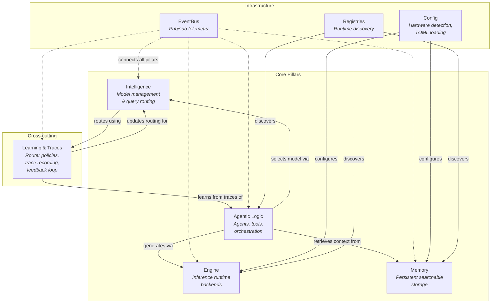
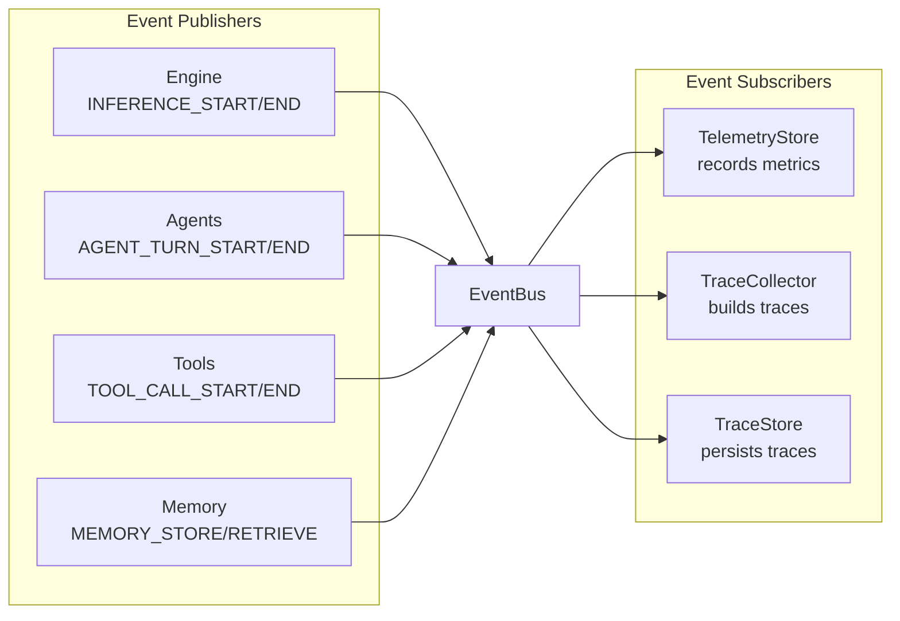

# Architecture Overview

OpenJarvis is a research framework for studying on-device AI systems. Its architecture is organized around **four core abstractions** -- Intelligence, Engine, Agentic Logic, and Memory -- plus a cross-cutting **Learning** system that ties them together through trace-driven feedback.

---

## The Four Pillars + Learning



---

## Pillar Descriptions

### Intelligence

The Intelligence pillar handles **model management and query routing**. It maintains a catalog of known models (`BUILTIN_MODELS`) with metadata such as parameter count, context length, VRAM requirements, and supported engines. When a query arrives, the `HeuristicRouter` analyzes it for characteristics like code patterns, math keywords, length, and urgency, then selects the most appropriate model from those available.

Models discovered at runtime from running engines are automatically merged into the `ModelRegistry`, so the system always has an up-to-date view of what is available.

### Engine

The Engine pillar provides the **inference runtime** -- the layer that actually runs language models. All backends implement the `InferenceEngine` ABC with a uniform interface: `generate()`, `stream()`, `list_models()`, and `health()`. Supported backends include Ollama, vLLM, SGLang, llama.cpp, and Cloud (OpenAI, Anthropic, Google).

Engine discovery probes all registered backends for health, returning healthy engines sorted with the user's configured default first. The system automatically falls back to any available engine if the preferred one is unavailable.

### Agentic Logic

The Agentic Logic pillar implements **pluggable agents** that handle queries with varying levels of sophistication. `SimpleAgent` provides single-turn query-to-response without tools. `OrchestratorAgent` implements a multi-turn tool-calling loop where the LLM can invoke tools like `calculator`, `think`, `retrieval`, `llm`, and `file_read`, with results fed back for further processing. `OpenClawAgent` communicates with external OpenClaw servers via HTTP or subprocess transport.

All agents implement the `BaseAgent` ABC with a `run()` method, and are registered via `@AgentRegistry.register("name")`.

### Memory

The Memory pillar provides **persistent, searchable storage** for documents and knowledge. Five backends are available: SQLite/FTS5 (zero-dependency default), FAISS (dense vector retrieval), ColBERTv2 (late interaction), BM25 (classic term-frequency), and Hybrid (Reciprocal Rank Fusion of sparse + dense).

The memory pipeline includes document ingestion, chunking, embedding generation, and context injection. When a user sends a query, relevant documents are retrieved and prepended to the prompt with source attribution.

### Learning & Traces (Cross-cutting)

The Learning system is a cross-cutting concern that connects all pillars through **trace-driven feedback**. Every agent interaction can produce a `Trace` capturing the full sequence of steps -- routing decisions, memory retrieval, inference calls, tool invocations, and final responses. The `TraceAnalyzer` computes statistics from accumulated traces, and the `TraceDrivenPolicy` uses these statistics to learn which model/agent/tool combinations produce the best outcomes for different query types.

---

## The Registry Pattern

All extensible components in OpenJarvis use a **decorator-based registry** for runtime discovery. The pattern is implemented in `RegistryBase[T]`, a generic base class that provides isolated storage per typed subclass.

```python
from openjarvis.core.registry import EngineRegistry

@EngineRegistry.register("ollama")
class OllamaEngine(InferenceEngine):
    ...
```

Each registry provides:

| Method | Description |
|--------|-------------|
| `register(key)` | Decorator that registers a class under a key |
| `register_value(key, value)` | Imperative registration |
| `get(key)` | Retrieve by key (raises `KeyError` if missing) |
| `create(key, *args, **kwargs)` | Look up and instantiate |
| `items()` | All `(key, entry)` pairs |
| `keys()` | All registered keys |
| `contains(key)` | Check if key exists |
| `clear()` | Remove all entries (for tests) |

**Typed registries** in the system:

| Registry | Type Parameter | Purpose |
|----------|---------------|---------|
| `ModelRegistry` | `Any` (ModelSpec) | Model metadata |
| `EngineRegistry` | `Type[InferenceEngine]` | Inference backends |
| `MemoryRegistry` | `Type[MemoryBackend]` | Memory backends |
| `AgentRegistry` | `Type[BaseAgent]` | Agent implementations |
| `ToolRegistry` | `Any` (BaseTool classes) | Tool implementations |
| `RouterPolicyRegistry` | `Any` (RouterPolicy classes) | Router policies |
| `BenchmarkRegistry` | `Any` (BaseBenchmark classes) | Benchmark implementations |

!!! info "Adding a new component"
    To add a new backend, implement the appropriate ABC and decorate it with
    the corresponding registry decorator. No factory modifications are needed --
    the component becomes automatically discoverable at runtime.

---

## Source Directory Layout

```
src/openjarvis/
    core/               Core infrastructure shared by all pillars
        registry.py         RegistryBase[T] and typed subclass registries
        types.py            Message, ModelSpec, Trace, TelemetryRecord, etc.
        config.py           JarvisConfig, hardware detection, TOML loading
        events.py           EventBus pub/sub system (EventType, Event)

    intelligence/       Intelligence pillar -- model management & routing
        router.py           HeuristicRouter, build_routing_context()
        model_catalog.py    BUILTIN_MODELS list, merge_discovered_models()
        _stubs.py           (Shared with learning -- RoutingContext)

    engine/             Engine pillar -- inference runtime backends
        _stubs.py           InferenceEngine ABC
        _base.py            EngineConnectionError, messages_to_dicts()
        _openai_compat.py   Shared base for OpenAI-compatible engines
        _discovery.py       discover_engines(), discover_models(), get_engine()
        ollama.py           Ollama backend (native HTTP API)
        vllm.py             vLLM backend (OpenAI-compatible)
        sglang.py           SGLang backend (OpenAI-compatible)
        llamacpp.py         llama.cpp backend (OpenAI-compatible)
        cloud.py            Cloud backend (OpenAI, Anthropic, Google SDKs)

    agents/             Agentic Logic pillar -- pluggable agents
        _stubs.py           BaseAgent ABC, AgentContext, AgentResult
        simple.py           SimpleAgent (single-turn, no tools)
        orchestrator.py     OrchestratorAgent (multi-turn tool loop)
        openclaw.py         OpenClawAgent (HTTP/subprocess transport)
        custom.py           CustomAgent (template for user-defined agents)
        openclaw_protocol.py  Wire protocol (MessageType, serialize/deserialize)
        openclaw_transport.py Transport ABC, HttpTransport, SubprocessTransport
        openclaw_plugin.py  ProviderPlugin, MemorySearchManager

    memory/             Memory pillar -- persistent searchable storage
        _stubs.py           MemoryBackend ABC, RetrievalResult
        sqlite.py           SQLite/FTS5 backend (zero-dependency default)
        faiss_backend.py    FAISS dense retrieval backend
        colbert_backend.py  ColBERTv2 late interaction backend
        bm25.py             BM25 (Okapi) term-frequency backend
        hybrid.py           Hybrid RRF fusion backend
        chunking.py         ChunkConfig, Chunk, chunk_text()
        ingest.py           Document ingestion (file reading, directory walking)
        context.py          Context injection (inject_context, source attribution)
        embeddings.py       Embedder ABC, SentenceTransformerEmbedder

    learning/           Learning system -- router policies & rewards
        _stubs.py           RouterPolicy ABC, RewardFunction ABC, RoutingContext
        heuristic_policy.py Wires HeuristicRouter into RouterPolicyRegistry
        trace_policy.py     TraceDrivenPolicy (learns from trace outcomes)
        grpo_policy.py      GRPORouterPolicy (stub for future RL)
        heuristic_reward.py HeuristicRewardFunction (latency/cost/efficiency)

    traces/             Trace system -- interaction recording
        store.py            TraceStore (SQLite persistence)
        collector.py        TraceCollector (wraps agents, records traces)
        analyzer.py         TraceAnalyzer (aggregated statistics)

    tools/              Tool system -- pluggable tool implementations
        _stubs.py           BaseTool ABC, ToolSpec, ToolExecutor
        calculator.py       CalculatorTool (ast-based safe eval)
        think.py            ThinkTool (reasoning scratchpad)
        retrieval.py        RetrievalTool (memory search)
        llm.py              LLMTool (sub-model calls)
        file_read.py        FileReadTool (safe file reading)

    telemetry/          Telemetry -- inference metrics recording
        store.py            TelemetryStore (SQLite, EventBus subscription)
        aggregator.py       TelemetryAggregator (per-model/engine stats)
        wrapper.py          instrumented_generate() wrapper

    server/             API server -- OpenAI-compatible HTTP API
        app.py              FastAPI application factory
        routes.py           /v1/chat/completions, /v1/models, /health

    bench/              Benchmarking framework
        _stubs.py           BaseBenchmark ABC, BenchmarkSuite
        latency.py          LatencyBenchmark (per-call latency)
        throughput.py       ThroughputBenchmark (tokens/second)

    cli/                CLI commands (Click-based)
        ask.py              jarvis ask -- query the assistant
        serve.py            jarvis serve -- start API server

    sdk.py              Jarvis class -- high-level Python SDK
    mcp/                MCP (Model Context Protocol) layer
```

---

## How the Pillars Interact

### EventBus: The Connective Tissue

All pillars communicate through a **thread-safe pub/sub EventBus** defined in `core/events.py`. The bus uses synchronous dispatch -- subscribers are called in registration order within the publishing thread.



**Event types** in the system:

| Event | Publisher | Purpose |
|-------|----------|---------|
| `INFERENCE_START` / `INFERENCE_END` | Engine / Agent | Track inference calls |
| `TOOL_CALL_START` / `TOOL_CALL_END` | ToolExecutor | Track tool usage |
| `MEMORY_STORE` / `MEMORY_RETRIEVE` | Memory backends | Track memory operations |
| `AGENT_TURN_START` / `AGENT_TURN_END` | Agents | Track agent lifecycle |
| `TELEMETRY_RECORD` | TelemetryStore | Publish telemetry records |
| `TRACE_STEP` / `TRACE_COMPLETE` | TraceCollector | Trace lifecycle events |

### Dependency Flow

The pillars form a directed dependency graph:

1. **Agentic Logic** depends on Engine (for inference) and Memory (for context)
2. **Intelligence** provides model selection to agents via Learning policies
3. **Learning** reads from Traces, which are produced by Agentic Logic
4. **Memory** is independent but consumed by agents and tools
5. **Engine** is independent but consumed by agents and the SDK

This creates a feedback loop: agents produce traces, traces inform learning, learning improves routing, and better routing improves agent performance.
