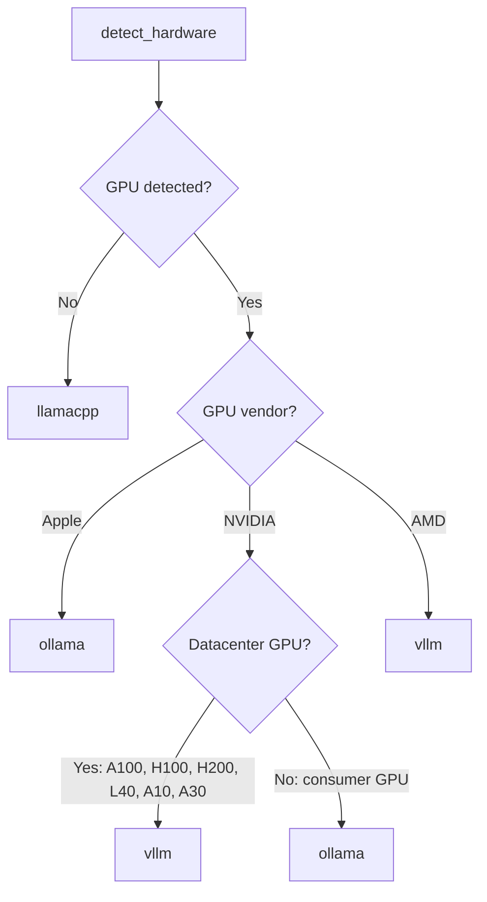

# Configuration

OpenJarvis uses a TOML configuration file to control engine selection, model routing, memory backends, agent behavior, and more. This page is the complete reference for every configuration option.

## Config File Location

The configuration file lives at:

```
~/.openjarvis/config.toml
```

OpenJarvis creates the `~/.openjarvis/` directory and populates it with a default config when you run `jarvis init`.

## Generating Configuration

### First-Time Setup

```bash
jarvis init
```

This command:

1. Runs hardware auto-detection (GPU vendor/model/VRAM, CPU brand/cores, RAM)
2. Selects the recommended engine based on your hardware
3. Writes `~/.openjarvis/config.toml` with sensible defaults

### Regenerating Configuration

To overwrite an existing config:

```bash
jarvis init --force
```

!!! warning
    `--force` overwrites your existing config file. Back up your config first if you have custom settings.

## Configuration Sections

The config file is organized into seven TOML sections. Every field has a default value, so you only need to specify the values you want to change.

---

### `[engine]` -- Inference Engine

Controls which inference engine is used and where each engine is listening.

```toml
[engine]
default = "ollama"
ollama_host = "http://localhost:11434"
vllm_host = "http://localhost:8000"
llamacpp_host = "http://localhost:8080"
llamacpp_path = ""
sglang_host = "http://localhost:30000"
```

| Field | Type | Default | Description |
|-------|------|---------|-------------|
| `default` | string | Auto-detected | Default engine backend. One of: `ollama`, `vllm`, `llamacpp`, `sglang`, `cloud`. Set automatically by `jarvis init` based on hardware detection. |
| `ollama_host` | string | `http://localhost:11434` | Base URL for the Ollama API server. |
| `vllm_host` | string | `http://localhost:8000` | Base URL for the vLLM OpenAI-compatible server. |
| `llamacpp_host` | string | `http://localhost:8080` | Base URL for the llama.cpp HTTP server (`llama-server`). |
| `llamacpp_path` | string | `""` | Path to the llama.cpp binary, if not on `$PATH`. |
| `sglang_host` | string | `http://localhost:30000` | Base URL for the SGLang server. |

!!! tip "Engine fallback"
    If the configured default engine is unreachable, OpenJarvis automatically probes all registered engines and falls back to any healthy one.

---

### `[intelligence]` -- Model Routing

Controls which model is selected by default and which model to fall back to.

```toml
[intelligence]
default_model = ""
fallback_model = ""
```

| Field | Type | Default | Description |
|-------|------|---------|-------------|
| `default_model` | string | `""` (empty) | Preferred model identifier (e.g., `qwen3:8b`). When empty, the router policy selects the model dynamically. |
| `fallback_model` | string | `""` (empty) | Model to use if the default is unavailable. |

When both fields are empty, OpenJarvis uses the configured router policy (see `[learning]`) to select a model from those available on the active engine.

---

### `[learning]` -- Router Policy

Controls how the learning system selects models for incoming queries.

```toml
[learning]
default_policy = "heuristic"
reward_weights = ""
```

| Field | Type | Default | Description |
|-------|------|---------|-------------|
| `default_policy` | string | `"heuristic"` | Router policy to use for model selection. Available: `heuristic`, `learned` (trace-driven), `grpo` (reinforcement learning stub). |
| `reward_weights` | string | `""` | Comma-separated key=value pairs for the reward function. Example: `"latency=0.4,cost=0.3,quality=0.3"`. |

**Router policies:**

| Policy | Description |
|--------|-------------|
| `heuristic` | Rule-based selection using 6 priority rules. Considers model availability, parameter count, context length, and query characteristics. Default. |
| `learned` | Trace-driven policy that learns from past interaction outcomes stored in the trace system. |
| `grpo` | Group Relative Policy Optimization stub for future RL-based routing. |

You can also override the router policy per-query via the CLI:

```bash
jarvis ask --router heuristic "Hello"
```

---

### `[memory]` -- Memory Backend

Controls the persistent memory system: which backend to use, how documents are chunked, and how context injection works.

```toml
[memory]
default_backend = "sqlite"
db_path = "~/.openjarvis/memory.db"
context_injection = true
context_top_k = 5
context_min_score = 0.1
context_max_tokens = 2048
chunk_size = 512
chunk_overlap = 64
```

| Field | Type | Default | Description |
|-------|------|---------|-------------|
| `default_backend` | string | `"sqlite"` | Memory backend to use. Available: `sqlite` (FTS5), `faiss`, `colbert`, `bm25`, `hybrid`. |
| `db_path` | string | `~/.openjarvis/memory.db` | Path to the SQLite memory database. Used by the `sqlite` backend. |
| `context_injection` | bool | `true` | Whether to automatically inject relevant memory context into queries. |
| `context_top_k` | int | `5` | Number of top memory results to inject as context. |
| `context_min_score` | float | `0.1` | Minimum relevance score for a memory result to be included in context. |
| `context_max_tokens` | int | `2048` | Maximum number of tokens to use for injected context. |
| `chunk_size` | int | `512` | Size of document chunks (in tokens) when indexing documents. |
| `chunk_overlap` | int | `64` | Overlap between adjacent chunks (in tokens) when indexing. |

**Memory backends:**

| Backend | Extra Required | Description |
|---------|---------------|-------------|
| `sqlite` | None | SQLite with FTS5 full-text search. Zero dependencies. Default. |
| `faiss` | `memory-faiss` | Facebook AI Similarity Search with sentence-transformer embeddings. |
| `colbert` | `memory-colbert` | ColBERTv2 late-interaction retrieval. Requires PyTorch. |
| `bm25` | `memory-bm25` | BM25 sparse retrieval via `rank-bm25`. |
| `hybrid` | Depends on sub-backends | Reciprocal Rank Fusion combining multiple backends. |

!!! note "Context injection"
    When `context_injection` is enabled and documents have been indexed, every query automatically searches memory for relevant chunks and prepends them as system context. This gives the model access to your indexed knowledge base without any extra steps. Disable with `--no-context` on the CLI or `context=False` in the SDK.

---

### `[agent]` -- Agent Defaults

Controls the default agent behavior for queries.

```toml
[agent]
default_agent = "simple"
max_turns = 10
default_tools = ""
temperature = 0.7
max_tokens = 1024
```

| Field | Type | Default | Description |
|-------|------|---------|-------------|
| `default_agent` | string | `"simple"` | Default agent to use. Available: `simple`, `orchestrator`, `custom`, `openclaw`. |
| `max_turns` | int | `10` | Maximum number of tool-calling turns for the orchestrator agent before it must produce a final answer. |
| `default_tools` | string | `""` | Comma-separated list of tools to enable by default (e.g., `"calculator,think"`). |
| `temperature` | float | `0.7` | Default sampling temperature for generation. |
| `max_tokens` | int | `1024` | Default maximum tokens for generation. |

---

### `[server]` -- API Server

Controls the OpenAI-compatible API server started by `jarvis serve`.

```toml
[server]
host = "0.0.0.0"
port = 8000
agent = "orchestrator"
model = ""
workers = 1
```

| Field | Type | Default | Description |
|-------|------|---------|-------------|
| `host` | string | `"0.0.0.0"` | Bind address for the server. Use `"127.0.0.1"` to restrict to localhost. |
| `port` | int | `8000` | Port number for the server. |
| `agent` | string | `"orchestrator"` | Agent to use for non-streaming chat completion requests. |
| `model` | string | `""` | Default model for the server. When empty, uses `intelligence.default_model` or the first available model. |
| `workers` | int | `1` | Number of uvicorn worker processes. |

CLI options override config values:

```bash
jarvis serve --host 127.0.0.1 --port 9000 --model qwen3:8b --agent simple
```

---

### `[telemetry]` -- Telemetry Persistence

Controls whether inference telemetry is recorded and where it is stored.

```toml
[telemetry]
enabled = true
db_path = "~/.openjarvis/telemetry.db"
```

| Field | Type | Default | Description |
|-------|------|---------|-------------|
| `enabled` | bool | `true` | Whether to record telemetry for each inference call. Records timing, token counts, model, engine, and cost. |
| `db_path` | string | `~/.openjarvis/telemetry.db` | Path to the SQLite telemetry database. |

!!! info "Telemetry is local-only"
    All telemetry data is stored locally in a SQLite database. No data is ever sent to external services.

---

## Hardware Auto-Detection

When you run `jarvis init`, OpenJarvis probes your system to detect available hardware. The detection runs in this order:

### GPU Detection

1. **NVIDIA GPU** -- Checks for `nvidia-smi` on `$PATH`. If found, queries GPU name, VRAM (in MB), and GPU count via:

    ```
    nvidia-smi --query-gpu=name,memory.total,count --format=csv,noheader,nounits
    ```

2. **AMD GPU** -- Checks for `rocm-smi` on `$PATH`. If found, queries the product name via:

    ```
    rocm-smi --showproductname
    ```

3. **Apple Silicon** -- On macOS only. Runs `system_profiler SPDisplaysDataType` and looks for "Apple" in the chipset model line.

If none of these detect a GPU, the system is treated as CPU-only.

### CPU and RAM Detection

- **CPU brand**: Reads from `sysctl -n machdep.cpu.brand_string` on macOS, or parses `model name` from `/proc/cpuinfo` on Linux.
- **CPU count**: Uses Python's `os.cpu_count()`.
- **RAM**: Reads from `sysctl -n hw.memsize` on macOS, or parses `MemTotal` from `/proc/meminfo` on Linux.

### Detected Hardware Dataclass

The detection result is stored as a `HardwareInfo` dataclass:

```python
@dataclass
class HardwareInfo:
    platform: str      # "linux", "darwin", "windows"
    cpu_brand: str     # e.g., "AMD EPYC 7763"
    cpu_count: int     # e.g., 128
    ram_gb: float      # e.g., 512.0
    gpu: GpuInfo | None

@dataclass
class GpuInfo:
    vendor: str             # "nvidia", "amd", "apple"
    name: str               # e.g., "NVIDIA A100-SXM4-80GB"
    vram_gb: float          # e.g., 80.0
    compute_capability: str # (NVIDIA only)
    count: int              # e.g., 8
```

---

## Engine Recommendation Logic

Based on the detected hardware, `recommend_engine()` selects the optimal default engine:



| Hardware | Recommended Engine | Reason |
|----------|--------------------|--------|
| No GPU | `llamacpp` | Efficient CPU inference with GGUF quantized models |
| Apple Silicon | `ollama` | Native Metal acceleration, easy model management |
| NVIDIA consumer GPU (RTX 3090, 4090, etc.) | `ollama` | Simple setup, good performance for single-user |
| NVIDIA datacenter GPU (A100, H100, H200, L40, A10, A30) | `vllm` | High-throughput batched serving, continuous batching |
| AMD GPU | `vllm` | ROCm support via vLLM |

---

## Example Configurations

### Apple Silicon Mac

```toml
# ~/.openjarvis/config.toml
# Apple Silicon MacBook Pro (M3 Max, 128 GB unified memory)

[engine]
default = "ollama"
ollama_host = "http://localhost:11434"

[intelligence]
default_model = "qwen3:8b"
fallback_model = "llama3.2:3b"

[memory]
default_backend = "sqlite"
context_injection = true
context_top_k = 5

[agent]
default_agent = "simple"
max_turns = 10

[server]
host = "127.0.0.1"
port = 8000
agent = "orchestrator"

[learning]
default_policy = "heuristic"

[telemetry]
enabled = true
```

### NVIDIA Datacenter (Multi-GPU)

```toml
# ~/.openjarvis/config.toml
# 8x NVIDIA A100 80GB server

[engine]
default = "vllm"
vllm_host = "http://localhost:8000"
ollama_host = "http://localhost:11434"

[intelligence]
default_model = "Qwen/Qwen2.5-72B-Instruct"
fallback_model = "Qwen/Qwen2.5-7B-Instruct"

[memory]
default_backend = "faiss"
context_injection = true
context_top_k = 10
context_min_score = 0.05
context_max_tokens = 4096
chunk_size = 1024
chunk_overlap = 128

[agent]
default_agent = "orchestrator"
max_turns = 15
default_tools = "calculator,think,retrieval"
temperature = 0.5
max_tokens = 4096

[server]
host = "0.0.0.0"
port = 8000
agent = "orchestrator"
model = "Qwen/Qwen2.5-72B-Instruct"
workers = 1

[learning]
default_policy = "heuristic"

[telemetry]
enabled = true
```

### CPU-Only (No GPU)

```toml
# ~/.openjarvis/config.toml
# CPU-only machine

[engine]
default = "llamacpp"
llamacpp_host = "http://localhost:8080"

[intelligence]
default_model = ""
fallback_model = ""

[memory]
default_backend = "sqlite"
context_injection = true
context_top_k = 3
context_max_tokens = 1024
chunk_size = 256
chunk_overlap = 32

[agent]
default_agent = "simple"
max_turns = 5
temperature = 0.7
max_tokens = 512

[server]
host = "127.0.0.1"
port = 8000

[learning]
default_policy = "heuristic"

[telemetry]
enabled = true
```

### Cloud-Only (No Local Engine)

```toml
# ~/.openjarvis/config.toml
# Using cloud APIs only (OpenAI, Anthropic)
# Set OPENAI_API_KEY and/or ANTHROPIC_API_KEY environment variables

[engine]
default = "cloud"

[intelligence]
default_model = "gpt-4o"
fallback_model = "claude-sonnet-4-20250514"

[memory]
default_backend = "sqlite"
context_injection = true

[agent]
default_agent = "orchestrator"
default_tools = "calculator,think"

[telemetry]
enabled = true
```

### Hybrid (Local + Cloud Fallback)

```toml
# ~/.openjarvis/config.toml
# Local Ollama as primary, cloud as fallback

[engine]
default = "ollama"
ollama_host = "http://localhost:11434"

[intelligence]
default_model = "qwen3:8b"
fallback_model = "gpt-4o-mini"

[memory]
default_backend = "sqlite"
context_injection = true

[agent]
default_agent = "orchestrator"
max_turns = 10
default_tools = "calculator,think"

[learning]
default_policy = "heuristic"

[telemetry]
enabled = true
```

---

## Programmatic Configuration

You can also configure OpenJarvis entirely from Python without a TOML file:

```python
from openjarvis import Jarvis
from openjarvis.core.config import (
    AgentConfig,
    EngineConfig,
    IntelligenceConfig,
    JarvisConfig,
    MemoryConfig,
)

config = JarvisConfig(
    engine=EngineConfig(
        default="ollama",
        ollama_host="http://my-server:11434",
    ),
    intelligence=IntelligenceConfig(
        default_model="qwen3:8b",
    ),
    memory=MemoryConfig(
        default_backend="sqlite",
        context_injection=True,
        context_top_k=10,
    ),
    agent=AgentConfig(
        default_agent="orchestrator",
        max_turns=15,
    ),
)

j = Jarvis(config=config)
response = j.ask("Hello")
j.close()
```

Or load from a custom path:

```python
j = Jarvis(config_path="/path/to/my-config.toml")
```

---

## Environment Variables

OpenJarvis respects the following environment variables:

| Variable | Description |
|----------|-------------|
| `OPENAI_API_KEY` | API key for OpenAI cloud inference. Required for the `cloud` engine with OpenAI models. |
| `ANTHROPIC_API_KEY` | API key for Anthropic cloud inference. Required for the `cloud` engine with Claude models. |
| `GOOGLE_API_KEY` | API key for Google Gemini inference. Required for the `google` engine. |
| `TAVILY_API_KEY` | API key for the Tavily web search tool. Required for the `web_search` tool. |

## Next Steps

- [Quick Start](quickstart.md) -- Run your first query
- [CLI Reference](../user-guide/cli.md) -- Full reference for all CLI commands
- [Architecture Overview](../architecture/overview.md) -- Understand how the pieces fit together
